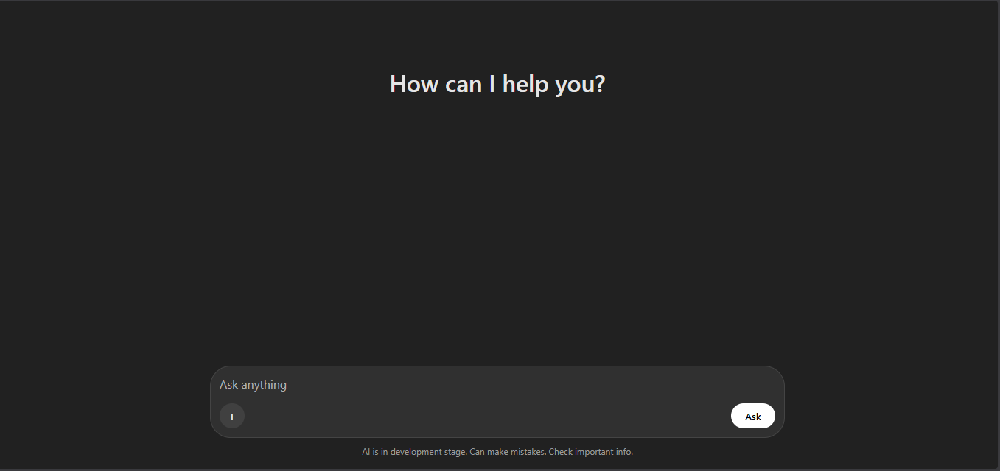
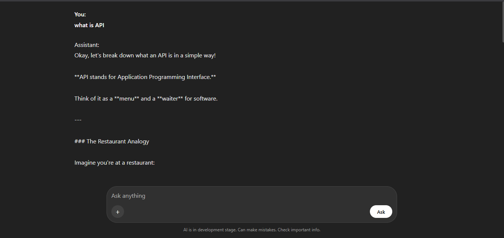

# AI Assistant

A simple AI-powered Assistant built using **Flask**, **HTML/CSS**, and **Google Gemini API**. The application provides a clean chat interface where users can ask questions and receive AI-generated responses in real time.

## Features

* Modern ChatGPT-style UI
* Powered by Google Gemini 3.5 Flash
* Flask backend
* Responsive design for desktop and mobile
* Environment variable support using `.env`
* Real-time AI responses via Fetch API

---

## Project Structure

```text
AI-Assistant/
│
├── main.py
├── .env
├── .gitignore
├── requirements.txt
│
├── static/
│   └── style.css
│
├── templates/
│   └── index.html
│
├── screenshots/
│   ├── home.png
│   └── chat.png
│
└── README.md
```

---

## Technologies Used

### Backend

* Python
* Flask
* Google Gemini API
* python-dotenv

### Frontend

* HTML5
* CSS3
* JavaScript (Fetch API)

---

## Installation

### 1. Clone the Repository

```bash
git clone https://github.com/lalithsai-gif/AI-Assistant.git
cd AI-Assistant
```

### 2. Create a Virtual Environment

Windows:

```bash
python -m venv venv
venv\Scripts\activate
```

Linux/macOS:

```bash
python3 -m venv venv
source venv/bin/activate
```

### 3. Install Dependencies

```bash
pip install -r requirements.txt
```

---

## Environment Variables

Create a `.env` file in the root directory:

```env
api_key_gemini=YOUR_GEMINI_API_KEY
```

Get your API key from Google AI Studio.

---

## Run the Application

```bash
python main.py
```

The application will start on:

```text
http://127.0.0.1:5000
```

Open the URL in your browser.

---

## API Endpoint

### POST /query

Request:

```json
{
  "query": "What is Artificial Intelligence?"
}
```

Response:

```json
{
  "response": "Artificial Intelligence (AI) is..."
}
```

---

## Dependencies

Example `requirements.txt`:

```txt
Flask
python-dotenv
google-genai
```

Generate automatically:

```bash
pip freeze > requirements.txt
```

---

## Screenshots

### Home Page



### Chat Interface



## Demo Video

🎥 Watch the demo here:

https://youtu.be/ChLel5XN1_g

---

## Future Improvements

* Chat history storage
* Markdown response rendering
* Dark/Light theme toggle
* Streaming responses
* Voice input support
* User authentication
* File upload support

---

## Security Notes

* Never commit your `.env` file.
* Keep your Gemini API key private.
* Add `.env` to `.gitignore`.

Example:

```gitignore
.env
__pycache__/
venv/
```

---

## License

This project is licensed under the MIT License.

---

## Author

Developed by D.Lalith Sai 

GitHub: https://github.com/lalithsai-gif
LinkedIn: https://www.linkedin.com/in/lalithsai-dabbiru-9b281b375
